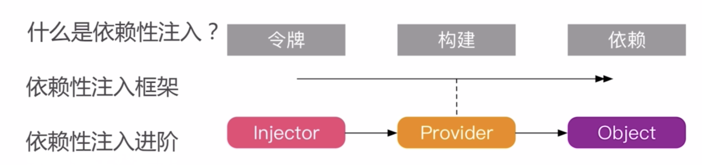
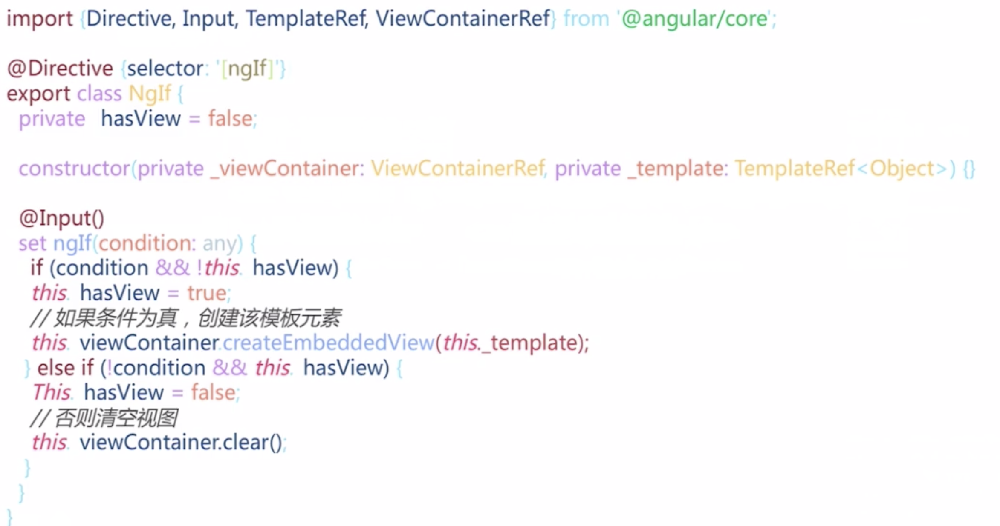

# 依赖注入

依赖注入的原理是一层一层往上推，把需要依赖的构造函数都推到入口函数，由此产生了依赖注入框架

**例子**

当前有三个class，Id、address、person。person依赖另外两个，在构建person的时候可以通过实例另外两个class然后实例话自己，
但是在依赖注入中并没有这样做，而是把实例化构建的任务又往上一层推了

```
class Id {
  static getInstance(type: string): Id {
    return new Id();
  }
}

class Address {
  city: string;
  street: string;
  constructor(city, street) {
    this.city = city;
    this.street = street;
  }
}

class Person {
  id: Id;
  address: Address;
  constructor(id: Id, address: Address) {
   this.id = id;
   this.address = address;
  }
}
```

**angular依赖注入的原始**

ReflectiveInjector.resolveAndCreate方法构建一个注册池，
provide为依赖的注入的令牌

```
mian() {
  const injector = ReflectiveInjector.resolveAndCreate([
      {provide: Person, useClass: Person},
      {
        provide: Address, useFactory: () => {
          if (environment.production) {
            return new Address('深圳', '坂田');
          } else {
            return new Address('深圳', '南山');
          }
        }
      },
      {
        provide: Id, useFactory: () => {
          return Id.getInstance('idCard');
        }
      }
    ]);
    const person = injector.get(Person)
}

class Id {
  static getInstance(type: string): Id {
    return new Id();
  }
}

class Address {
  city: string;
  street: string;
  constructor(city, street) {
    this.city = city;
    this.street = street;
  }
}

class Person {
  id: Id;
  address: Address;
  constructor(@Inject(Id) id, @Inject(Address) address) {
   this.id = id;
   this.address = address;
  }
}

```


依赖注入后，angular会把注入的类变成一个单件，也就是所有依赖的类，获取的值是一样的，
如果想要每次获取不同的值还需要进行处理


方法一：通过工厂模式返回一个方法

```
{
    provide: Address, useFactory: () => {
      if (environment.production) {
        return new Address('深圳', '坂田');
      } else {
        return new Address('深圳', '南山');
      }
    }
}
改成
{
    provide: Address, useFactory: () => {
       return () => {
        if (environment.production) {
          return new Address('深圳', '坂田');
        } else {
          return new Address('深圳', '南山');
        }
      }
    }
}
```

方法二：创建一个子依赖注入
```
const childInjector = ReflectiveInjector.resolveAndCreate([Person]);
const person = injector.get(Person);
const child = childInjector.get(Person);

child 与 person 不相等
```
上述方法创建子注入者的时候，只提供了Person但并没有提供Id和Address，
但却能创建成功，原因在于，子注入池找不到的时候就会去父注入池里面找，
这就是angular父子组件有的依赖子组件也能用


#ChangeDetection

检测程序内部状态，然后反应到UI上面去

引起状态变化：Events，XHR，Timers（都是异步）

ApplicationRef监听NgZone的OnTurnDoen，然后进行检测

默认策略，当一个组件发生变化，所有的组件树都发生变化

Onpush策略，外部的发生变化才会检测，否则自身发生状态更改要手动设置
  ```
  constructor(private cd: ChangeDetectorRef) { }
  
  this.cd.markForCheck();
```

项目过大为了性能需要做ChangeDetection策略


#指令

组件是一种带模板的指令

指令分为结构型指令（改变布局） 和 属性型指令（改变外观和行为）


**结构型指令**

结构指令的*是语法糖

```<div *ngIf="true"></div>```
```
   <ng-template [ngIf]='true'>
      <div></div>
   </ng-template>
```

下图为ngIf的指令



#Module中的footRoot，footChild方法

这两个方法其实是模块的静态方法
可以看成是个工厂方法，当不同情况要给不同的元数据时就可以写这个方法

```
import {ModuleWithProviders, NgModule} from '@angular/core';

@NgModule()
export class ServicesModule {
  static footRoot(): ModuleWithProviders {
    return {
      ngModule: ServicesModule,
      providers: []
    };
  }
}

```


